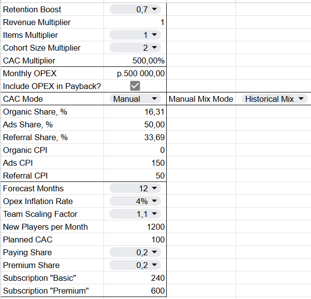
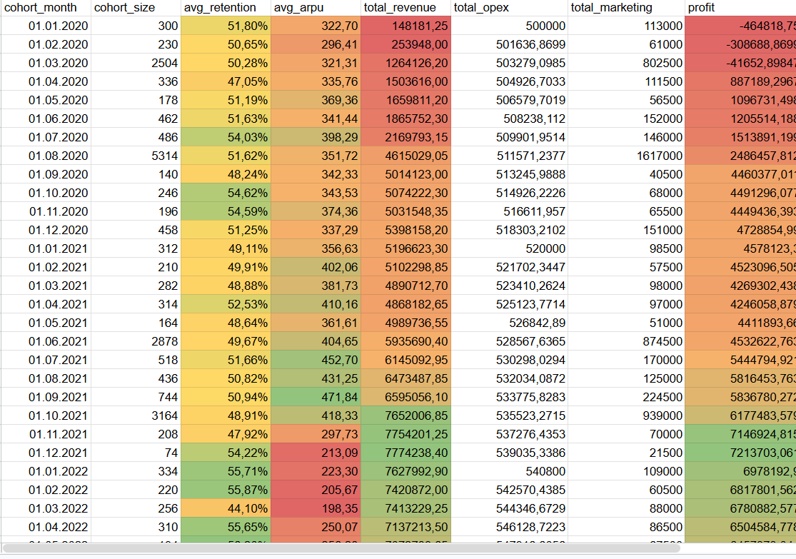
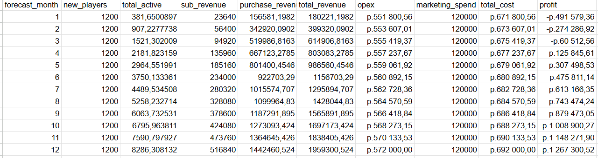

# Profit Forge Online

> Полноценная аналитическая BI-система моделирования юнит-экономики мобильной игры.

---

# О проекте

Profit Forge Online — это комплексный pet-проект, демонстрирующий полный цикл аналитической обработки данных: от генерации синтетического датасета до построения интерактивной BI-системы для сценарного анализа и прогнозирования финансовых показателей продукта.

В отличие от большинства учебных проектов, где демонстрируется отдельный инструмент (SQL, Python или Power BI), данный проект объединяет их в единую архитектуру.

В рамках проекта реализованы:

- генерация реалистичных игровых данных;
- ETL-конвейер подготовки данных;
- когортный анализ;
- динамическая модель юнит-экономики;
- прогнозирование финансовых показателей;
- сценарное моделирование;
- обновление Power BI без ручной настройки источников данных.

Проект имитирует рабочий процесс продуктового аналитика при анализе мобильного продукта с подписочной моделью и внутриигровыми покупками.

---

# Цель проекта

Основной целью являлось создание воспроизводимой аналитической системы, позволяющей моделировать влияние изменений продуктовых и маркетинговых параметров на финансовые показатели продукта.

Проект позволяет ответить на вопросы:

- реализовать полный аналитический конвейер;
- отказаться от ручного пересчёта показателей;
- создать воспроизводимую модель;
- обеспечить возможность быстрого изменения сценариев;
- отделить слой хранения данных от аналитической модели;
- реализовать прогнозирование без изменения исторических данных;
- обеспечить интеграцию с Power BI по упрощёной схеме настройки источников.

---
# Структура проекта


```
Profit Forge Online

├── data/
│
│   ├── players.csv
│   ├── purchases.csv
│   ├── subscriptions.csv
│   ├── marketing_spend.csv
│   └── cohort_data.csv
│
├── scripts/
│
│   ├── generate_dataset.py
│   ├── generate_dataset_configurable.py
│   └── prepare_data.py
│
├── connector/
│
│   └── ProfitForge_Connector.xlsx
│
├── powerbi/
│
│   └── ProfitForge_Dashboard.pbix
│
├── screenshots/
│
├── docs/
│
│   └── FULL_README.md
│
├── README.md
│
└── LICENSE
```

---

# Архитектура проекта

Проект построен как последовательный аналитический конвейер.

```
                  Python
             Генерация данных
                     │
                     ▼
                CSV Dataset
                     │
                     ▼
              ETL (Python)
                     │
                     ▼
               Cohort Dataset
                     │
                     ▼
               Google Sheets
         (Бизнес-модель продукта)
                     │
                     ▼
                   Excel
                     │
                     ▼
                  Power BI
              Dashboard + KPI
```

Каждый уровень отвечает только за собственную область ответственности.

Благодаря этому архитектура легко расширяется, а отдельные компоненты могут использоваться независимо друг от друга.

## Использование AI при разработке

Проект разрабатывался с использованием AI-ассистента как инженерного инструмента.

Использование AI не ограничивалось простой генерацией кода.

Во время разработки применялся итерационный подход:

- постановка задачи;
- получение одного или нескольких вариантов реализации;
- анализ предложенного решения;
- тестирование;
- поиск ошибок;
- изменение бизнес-логики;
- повторная реализация до получения необходимого результата.

AI использовался преимущественно для ускорения разработки отдельных компонентов:

- генерации функций Python;
- помощи при написании сложных формул Google Sheets;
- рефакторинга отдельных участков кода.

Архитектура проекта, бизнес-логика, интеграция компонентов, проверка расчётов, тестирование и финальная адаптация решений выполнялись вручную.

---

# Основные возможности

## Общая информация

Проект использует собственный модуль имитационного моделирования пользовательского поведения.

В отличие от генераторов случайных данных, используемых исключительно для заполнения таблиц, данный модуль моделирует поведение пользователей мобильной игры.

Цель генератора — получить данные, максимально приближенные к реальной эксплуатации продукта.

После завершения работы автоматически формируются четыре набора данных.

| Файл | Назначение |
|------|------------|
| players.csv | Пользователи |
| subscriptions.csv | Подписки |
| purchases.csv | Покупки |
| marketing_spend.csv | Маркетинговые расходы |

---    
## Основные возможности генератора

Генератор позволяет настраивать практически все ключевые параметры модели.

Перед запуском пользователь может изменить:

- количество игроков;
- период моделирования;
- базовый Retention;
- стоимость подписок;
- вероятности оформления подписок;
- вероятности повышения тарифа;
- вероятность возврата пользователя;
- вероятность совершения покупок;
- количество покупок;
- параметры игровых предметов;
- сезонность;
- маркетинговые каналы;
- стоимость привлечения;
- параметры игровых событий.

Благодаря этому генератор можно использовать для построения различных продуктовых сценариев.

---
# Поведение игроков

Каждый пользователь моделируется независимо.

Во время генерации симулируются:

- регистрация;
- выбор канала привлечения;
- страна;
- активность;
- удержание;
- отток;
- возврат;
- оформление подписки;
- переход между тарифами;
- внутриигровые покупки.
---
# Сезонность

Количество новых установок зависит от месяца.

Для каждого месяца задаётся собственный вес.

Например:

- летние месяцы могут иметь повышенный коэффициент;
- зимние — пониженный;
- пользователь может полностью изменить распределение самостоятельно.

После нормализации коэффициентов они используются при генерации дат установки.

Таким образом формируется естественная сезонность продукта.

---
# Игровые события

Генератор поддерживает случайные игровые события.

Во время события автоматически изменяются:

- количество новых игроков;
- коэффициент удержания.

Каждое событие имеет случайную силу воздействия.

Это позволяет моделировать:

- рекламные кампании;
- крупные игровые обновления;
- праздничные акции;
- временные события.

За счёт этого итоговые данные приобретают дополнительную вариативность и становятся ближе к реальным продуктовым данным.

---
## Особенности реализации

Генератор построен с использованием библиотеки NumPy и максимально использует векторизованные вычисления.

Это позволяет достаточно быстро создавать большие датасеты (сотни тысяч и миллионы записей) без существенной потери производительности.

Используются:

- NumPy
- Pandas
- Pathlib
- datetime

## Использование AI

Первоначальная структура генератора была создана при помощи AI-ассистента.

Со стороны автора проекта были определены:

- бизнес-логика генерации;
- состав моделируемых сущностей;
- взаимосвязи между таблицами;
- продуктовые сценарии;
- требования к данным;
- последовательные доработки и расширение функциональности.

По мере разработки генератор неоднократно перерабатывался, расширялся и адаптировался под требования аналитической модели проекта.

Проект демонстрирует умение формулировать технические требования, проверять корректность реализации и интегрировать AI как инструмент разработки, а не источник готового решения.
---

## ETL

✔ Подготовка когортной витрины

✔ Расчет продуктовых метрик

✔ Очистка данных

✔ Денормализация

✔ Построение аналитической таблицы

---
## ⚙️ ETL-обработка (prepare_data.py)

Скрипт преобразует сырые CSV в когортную витрину `cohort_data.csv` со следующими метриками:

| Колонка | Описание |
|---------|----------|
| `cohort_month` | Месяц регистрации когорты |
| `life_month` | Месяц жизни когорты (0, 1, 2, ...) |
| `active_players` | Активные игроки |
| `paying_players` | Платящие игроки |
| `total_sub_revenue` | Выручка от подписок |
| `total_purchase_revenue` | Выручка от покупок |
| `total_items_bought` | Количество купленных предметов |
| `cohort_size` | Размер когорты |
| `retention_rate` | Удержание (%) |

---
## Архитектура обработки

Во время выполнения ETL:

1. загружаются все исходные CSV;
2. объединяются данные игроков, подписок и покупок;
3. рассчитываются размеры когорт;
4. определяется месяц жизни каждого игрока;
5. агрегируются продуктовые метрики;
6. рассчитываются финансовые показатели;
7. формируется итоговая когортная таблица.

После выполнения этапа дальнейшие расчёты выполняются уже без использования Python.

--- 
## Назначение

Разделение проекта на генерацию данных и ETL позволяет независимо изменять:

- параметры моделирования;
- объём данных;
- продуктовые сценарии;
- маркетинговые стратегии.

Без необходимости изменять аналитическую модель или дашборд.

---

## Аналитическая модель

✔ Сценарное моделирование

✔ Управление CAC

✔ Управление Retention

✔ Управление Revenue

✔ Управление размером когорт

✔ Управление структурой каналов

✔ Прогнозирование

---
## Структура модели

## 📈 Модель в Google Sheets

### Структура листов

| Лист | Назначение |
|------|------------|
| **CohortData** | Неизменяемый источник «сырой правды». Импорт CSV из Python для обеспечения стабильного фундамента. |
| **MarketingCAC** | Фактическая стоимость привлечения одного пользователя (CAC) по месяцам. Глобальный рычаг управления. |
| **ChannelMix** | Исторические доли и CPI по каналам (Organic, Ads, Referral). Фундамент для детального ручного управления CAC. |
| **Inputs** | Единая панель управления всеми рычагами модели (Retention, Revenue, CAC, OPEX, каналы, прогноз, подписки). |
| **Scenario** | Динамическая историческая витрина. Пересчитывает прошлое по текущим настройкам Inputs. |
| **Trends** | Скользящий эталон удержания и ARPU за последний год. Актуальная «память» продукта для прогноза. |
| **Forecast** | Операционный прогноз на 1–12 месяцев. Показывает общую картину по продукту (игроки, выручка, прибыль), сделан отдельно для возможнности масштабировани не перенося формулы. |
| **Dashboard** | Операционный дашборд с денежным потоком (выручка, OPEX, маркетинг, прибыль) по календарным месяцам и тепловым форматированием, сделан для быстрого взгляда на ключевые показатели. |

Панель управления 

Тепловая карта 

Прогноз 

---

### Панель управления (Inputs)

Пользователь может менять следующие параметры:

| Параметр | Описание |
|----------|----------|
| Retention Boost | Множитель удержания |
| Revenue Multiplier | Множитель выручки |
| Items Multiplier | Множитель покупок |
| Cohort Size Multiplier | Множитель размера когорт |
| CAC Multiplier | Множитель CAC |
| Monthly OPEX | Ежемесячные операционные расходы |
| Include OPEX in Payback? | Учитывать ли операционные расходы при подсчёте флага окупаемости
| CAC Mode | Historical - расчет опираясь на истроические параметры / Manual - расчет из парметров пользователя |
| Manual Mix Mode | Historical Mix* / Manual Mix* |
| Organic / Ads / Referral Share | Доли каналов - 100% максимум регулируются автоматически |
| CPI по каналам | Стоимость установки |
| Forecast Months | Количество месяцев прогноза 1-12 |
| Opex Inflation Rate | Инфляция OPEX |
| Team Scaling Factor | Масштабирование штата |
| New Players per Month | Новые игроки в месяц |
| Planned CAC | Плановый CAC |
| Paying Share | Доля платящих |
| Premium Share | Доля премиум-подписок |
| Subscription Prices | Цены Basic / Premium |

### Режимы CAC

- **Historical Mix*** — CAC рассчитывается на основе исторических данных, изменчив
- **Manual Mix*** — CAC статичный, задаётся пользователем

Изменение любого параметра приводит к автоматическому пересчёту всей модели.

---

## Scenario

Лист Scenario представляет собой динамическую историческую витрину.

В отличие от CohortData, содержащего результаты ETL, Scenario пересчитывает показатели с учётом выбранных пользователем параметров.

Внутри модели рассчитываются:

- Cohort Month
- Life Month
- Active Players
- Paying Players
- Sub Revenue
- Purchase Revenue
- Total Revenue
- ARPY
- ARPPY
- Cumulative LTV
- ROMI
- Payback Flag
- Items Bought
- Cohort Size
- Retention Rate
- CAC
- Monthly OPEX
- Total Marketing Spend
- Total Cohort Cost
- Total Cohort Revenue
- Profit
									

Практически все вычисления выполняются при помощи массивных формул (`ARRAYFORMULA`), что позволяет отказаться от ручного копирования формул при добавлении новых данных.

---
## Принципы построения

При разработке модели использовались следующие принципы:

- отсутствие ручного протягивания формул;
- отказ от жёстко заданных диапазонов;
- минимизация дублирования логики;
- разделение исторических данных и расчётных моделей;
- воспроизводимость результатов;
- масштабируемость.

Благодаря этому модель остаётся работоспособной даже после увеличения объёма данных или изменения сценариев расчёта.

---

## Прогнозный модуль (Forecast)

Прогноз содержит следующие показатели:

| Показатель | Описание |
|------------|----------|
| `forecast_month` | Месяц прогноза |
| `new_players` | Новые игроки |
| `total_active` | Активные игроки |
| `sub_revenue` | Выручка от подписок |
| `purchase_revenue` | Выручка от покупок |
| `total_revenue` | Общая выручка |
| `opex` | Операционные расходы |
| `marketing_spend` | Расходы на маркетинг |
| `total_cost` | Общие расходы |
| `profit` | Прибыль |

**Прогноз строится на основе скользящего эталона (Trends) и учитывает:**
- Ежемесячную инфляцию OPEX
- Масштабирование штата (Team Scaling Factor)
- Плановый CAC и количество новых игроков
- Долю платящих и премиум-подписок

## Математическая модель

Forecast строится без использования жёстко заданных констант.

Все расчёты зависят исключительно от:

- пользовательских настроек;
- исторических трендов;
- возраста каждой когорты.

--- 
## Пользовательские сценарии

Forecast позволяет быстро проверить влияние различных продуктовых решений.

Например:

- увеличение удержания игроков;
- рост маркетингового бюджета;
- изменение структуры каналов привлечения;
- изменение стоимости подписок;
- изменение доли платящих пользователей;
- увеличение операционных расходов;
- масштабирование команды.

Это позволяет использовать модель как инструмент сценарного анализа (What-if Analysis).

---
## Практическая ценность

Модуль Forecast демонстрирует переход от анализа исторических данных к поддержке продуктовых решений.

Модель позволяет не только оценивать текущее состояние продукта, но и моделировать последствия различных управленческих решений ещё до их внедрения.

Именно этот этап объединяет когортный анализ, финансовое планирование и продуктовую аналитику в единую систему.

---

---

# Интеграция с Power BI

Одной из целей проекта было сделать процесс обновления данных максимально простым для конечного пользователя.

Вместо ручной настройки источников данных в Power BI был реализован промежуточный слой на базе Microsoft Excel и Power Query.

Такой подход позволяет заменить источник данных без изменения самого Power BI-проекта.

---

## Архитектура подключения

Схема обновления данных выглядит следующим образом:

```text
Google Sheets
        │
        ▼
 Excel Connector
(SettingsTable)
        │
        ▼
  Power Query
        │
        ▼
   Power BI
```

Пользователь взаимодействует только с Excel-файлом.

Power BI не требует перенастройки подключения после смены Google-таблицы.

---

## Как это работает

В Excel хранится небольшая таблица настроек.

В неё пользователь вставляет ссылку на свою Google-таблицу.

Power Query автоматически:

- считывает ссылку;
- удаляет лишнюю часть URL;
- формирует прямую ссылку на экспорт;
- скачивает актуальные данные;
- передаёт их в Power BI.

После этого остаётся нажать только одну кнопку — **Обновить**.

---

## Используемые технологии

При реализации использовались:

- Microsoft Excel;
- Power Query;
- язык M;
- Web.Contents();
- динамическое формирование URL;
- автоматическое обновление источника данных.

---

## Почему используется Excel

Power BI не позволяет удобно менять источник данных обычному пользователю.

Использование Excel в качестве промежуточного слоя позволяет решить сразу несколько задач:

- убрать необходимость изменять настройки Power BI;
- сделать обновление максимально простым;
- избежать ошибок подключения;
- сделать решение универсальным.

Таким образом Power BI становится полностью независимым от конкретной Google-таблицы.

---

## Пользовательский сценарий

Для обновления данных достаточно выполнить три действия.

1. Создать копию Google Sheets.
2. Вставить ссылку в Excel Connector.
3. Нажать **Обновить** в Power BI.

Все остальные действия выполняются автоматически.

---

# Архитектурные решения

Во время разработки проекта основное внимание уделялось не отдельным вычислениям, а построению масштабируемой аналитической системы.

По этой причине логика была разделена на независимые уровни.

```text
  Генерация данных (Python)
            │
            ▼
     ETL-преобразование
            │
            ▼
CohortData (Google Sheets)
            │
            ▼
 Динамическая аналитическая модель
            │
            ▼
   Forecast и Dashboard
            │
            ▼
     Excel Connector
            │
            ▼
        Power BI
```

Такое разделение позволяет изменять отдельные компоненты проекта независимо друг от друга.

Например:

- изменить генератор данных;
- заменить источник данных;
- изменить модель прогнозирования;
- переработать визуализацию.

При этом остальные части проекта продолжат работать без изменений.

---

# Использование AI при разработке

Проект создавался с активным использованием AI как инструмента разработки.

AI применялся для:

- генерации первоначальной структуры некоторых Python-скриптов;
- обсуждения вариантов реализации;
- поиска возможных решений;
- ускорения написания повторяющегося кода.

При этом архитектура проекта, постановка задачи, логика вычислений, структура модели и интеграция компонентов определялись автором проекта.

Во время разработки многие решения перерабатывались вручную после анализа промежуточных результатов.

Примеры подобных доработок:

- изменение архитектуры генератора данных;
- переработка логики когортной модели;
- исправление ошибок в формулах Google Sheets;
- устранение циклических зависимостей;
- переработка расчётов Forecast;
- проектирование коннектора между Google Sheets и Power BI.

Использование AI в данном проекте рассматривается как современный инструмент повышения производительности разработки, аналогично использованию IDE, документации или поисковых систем.

---

# Ограничения проекта

Несмотря на завершённость проекта, он имеет ряд сознательных ограничений.

## Синтетические данные

Все данные генерируются искусственно.

Они не отражают показатели конкретного продукта и используются исключительно для демонстрации аналитического процесса.

---

## Упрощённая бизнес-модель

Модель описывает типичный мобильный продукт с:

- подписочной моделью;
- внутриигровыми покупками;
- несколькими каналами привлечения пользователей.

Реальные продукты могут содержать значительно больше факторов.

---

## Прогнозирование

Forecast представляет собой сценарную модель.

Он предназначен для анализа различных вариантов развития продукта и не является инструментом точного финансового прогнозирования.

---

## Google Sheets

Часть вычислений реализована в Google Sheets.

При значительно большем объёме данных подобная модель должна быть перенесена в специализированное аналитическое хранилище или BI-платформу.

---

# Полученные навыки

В рамках проекта были получены практические навыки работы со всеми этапами аналитического процесса.

## Python

- генерация данных;
- работа с Pandas;
- обработка таблиц;
- построение ETL-процессов;
- организация структуры проекта.

---

## Аналитика

- когортный анализ;
- Retention;
- ARPU;
- ARPPU;
- LTV;
- CAC;
- ROMI;
- анализ окупаемости продукта.

---

## Google Sheets

- ARRAYFORMULA;
- LET;
- MAP;
- LAMBDA;
- MMULT;
- XLOOKUP;
- SUMIFS;
- условное форматирование;
- динамические модели.

---

## Power BI

- построение модели данных;
- DAX;
- визуализация;
- тепловые карты;
- финансовые KPI.


---

## Power Query

- подключение внешних источников;
- язык M;
- динамические URL;
- автоматизация обновления данных.

---

# Возможные направления развития

Проект может быть расширен без изменения существующей архитектуры.

Потенциальные направления развития:

- A/B Testing;
- LTV-прогнозирование с использованием ML;
- RFM-анализ пользователей;
- сегментация аудитории;
- Customer Lifetime Prediction;
- подключение PostgreSQL вместо CSV;
- автоматический ETL по расписанию;
- публикация дашборда через Power BI Service;
- интеграция с API рекламных кабинетов;
- расчёт дополнительных продуктовых метрик.

---

# Как запустить проект

### Вариант 1. Только модель Google Sheets (без генерации данных)
- Открыть ссылку на модель Google Sheets
- Создать копию документа
- Перейти на лист Inputs
- Настроить параметры модели
- Перейти на лист Scenario, Trends, Forecast, Dashboard — данные пересчитаются автоматически

### Вариант 2. Полный цикл (с генерацией данных)
Установить **python**:

- pip install pandas numpy

Запустить интерактивную генерацию данных:

- python generate_dataset_interactive.py

Запустить ETL-обработку:

- python prepare_data.py
- Импортировать cohort_data.csv в Google Sheets (лист CohortData)
- Открыть ProfitForge_Connector.xlsx и вставить ссылку на таблицу
- Открыть ProfitForge_Dashboard.pbix в Power BI и нажать Обновить

---

# Заключение

Profit Forge Online демонстрирует полный цикл разработки аналитической BI-системы.

Проект объединяет несколько направлений аналитики:

- генерацию данных;
- ETL;
- когортный анализ;
- продуктовую аналитику;
- финансовое моделирование;
- сценарный анализ;
- прогнозирование;
- визуализацию;
- автоматизацию обновления данных.

Главная цель проекта — показать не отдельный инструмент, а способность проектировать аналитические решения, состоящие из нескольких взаимосвязанных компонентов.

Несмотря на учебный характер проекта, при разработке использовались подходы, максимально приближённые к реальной практике построения аналитических систем.

---

🔗 Основные материалы

[Модель Google Sheets](https://docs.google.com/spreadsheets/d/17o_fmwWzHe7tDJiDwIyj6BBZnzIDwwFmJjiMKmpBaXE/edit?usp=sharing)

[Power BI Дашборд](./Визуализация/Dashboard.pbix)

[Коннектор](./Коннектор/ProfitForge_Connector.xlsx)

### **Примечания**

- Модель полностью открыта для редактирования — никакие ячейки не защищены, чтобы пользователь мог изучать логику
- Проект демонстрационный, данные синтетические
- Для работы требуется доступ к Google Sheets и Power BI Desktop
---

# 📄 Лицензия

Проект распространяется по лицензии **Apache License 2.0**.

Разрешается:

- использование проекта в личных и коммерческих целях;
- модификация исходного кода;
- распространение оригинальных и изменённых версий.

При использовании необходимо сохранить уведомление об авторстве и текст лицензии.

Подробнее см. файл [**LICENSE**](/LICENSE)

---

# Автор

[**@I_Dominus**](https://t.me/I_Dominus)

GitHub: https://github.com/Dominus251

---

# Благодарности

При разработке проекта использовались современные AI-инструменты в качестве помощников при проектировании и написании отдельных частей кода.

Все архитектурные решения, структура проекта, выбор технологий, аналитическая модель, интеграция компонентов и финальная реализация были определены и доработаны автором проекта.
