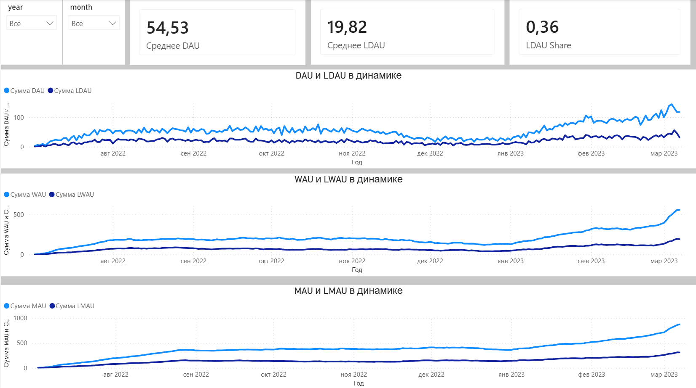
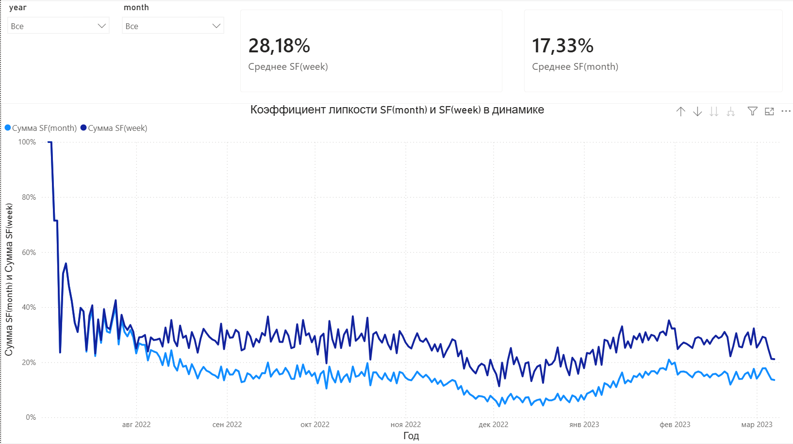

# Анализ активности пользователей Skygame

## Цель
Оценить ежедневную, еженедельную и ежемесячную активность пользователей, включая лояльную аудиторию с июля 2022 года по март 2023 года.

## Вводные

В первые три недели марта 2023 года проводилась акция: чем чаще игрок входил в игру, тем больше получал игровой валюты.

## Метрики
- DAU, WAU, MAU — общая активность
- LDAU, LWAU, LMAU — активность лояльных пользователей
- SF(week), SF(month) — коэффициент «липкости» (Stickiness Factor)

## Определение лояльного пользователя
Лояльным считается пользователь, у которого:
- медианная длительность сессии > 15 минут
- ИЛИ приглашено не менее 3 друзей

## Инструменты
- PostgreSQL (подготовка данных)
- Power BI (дашборд)

## Результаты

Скрипт запроса [DAU_WAU_MAU_LDAU_LWAU_LMAU_SF.sql](	./SQL/DAU_WAU_MAU_LDAU_LWAU_LMAU_SF.sql)

Результат запроса [dau_wau_mau_data.csv](./Экспорт/dau_wau_mau_data.csv)

Дашборд [Visual_BI_DAU_WAU_MAU.pbix](./Power_Bi/Dashboard/Visual_BI_DAU_WAU_MAU.pbix)

Скриншоты: 

- Динамика DAU/WAU/MAU по дням
- Сравнение общей и лояльной аудитории
- Stickiness Factor в разрезе недель и месяцев

## Выводы

- Наблюдается просадка DAU и SF в декабре 2022 года. Это является следствием сезонных факторов.
- Рост показателей в марте 2023 обусловлен успешностью проведенной акции.
- Падение показателей SF в марте 2023 обусловлено наплывом новых пользователей не задержавшихся на платформе.

## Рекомендации 

- Наблюдая позитивное влияние акции рекомендуется ввести подобные события на регулярной основе, но не более чем раз в квартал, для того чтобы аудитория имела возможность расширяться за счет самой себя и каждое  новое событие привлекало как можно больше активных игроков, которым нравится игра, а не акции. 
    - Если часть таких акций перевести в разряд хаотичных, это поддержит постоянных игроков дав им ощущение живости мира и участи в его истории, что несомненно повлечет за собой обсуждения.
- Учитывая падение SF в марте 2023 года можно предположить что: большое количество пользователей столкнулось с техническими проблемами на старте либо высоким порогом входа и первичной адаптации. Стоит проследить путь этих игроков, и найти самые узкие места, а также разослать по почте просьбу поделиться впечатлением и предложением вернуться за какой-либо бонус, который упростит адаптацию, но не внесёт дисбаланса в игру.