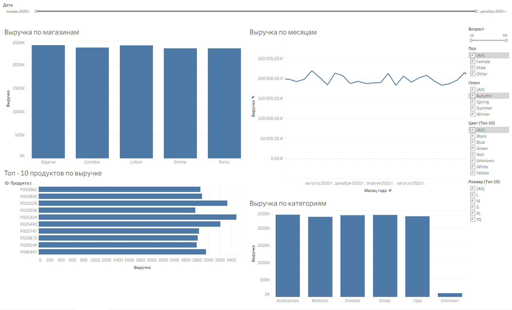

# Денормализация розничных данных и визуализация в Tableau

## Цель проекта

Построить ETL-процесс на Python для очистки и объединения четырёх таблиц (клиенты, продукты, транзакции, магазины) в единую витрину данных и создать интерактивные дашборды в Tableau.

## Источник данных 

[Messy Retail Fashion Data](https://www.kaggle.com/datasets/vanpatangan/retail-fashion-data/versions/1?select=customer_data.csv): недействительные ключи и грязные данные. 2500 строк и 4 таблицы. 

## Структура данных
Проект использует следующие основные таблицы:
| Таблица | Описане |
|---------|---------|
[`customer_data`](./Очищенные%20данные/cleaned_customer_data.csv) | Информация о клиентах (возраст, пол, город, email).
[`product_data`](./Очищенные%20данные/cleaned_product_data.csv) | Информация о товарах (категория, цвет, размер, цена, поставщик). 
[`sales_data`](./Очищенные%20данные/cleaned_sales_data.csv) | Транзакции (дата, количество, скидка, возвраты, связи с клиентами, товарами и магазинами).
[`store_data`](./Очищенные%20данные/cleaned_store_data.csv) | Информация о магазинах (название, регион, площадь).

## Этапы работы

### 1. Загрузка и первичный анализ данных

Каждая таблица загружалась через `pandas` и анализировалась:
- структура, типы данных, пропуски
- дубликаты, аномалии
- наличие битых внешних ключей

### 2. Очистка данных

| Таблица | Действия | Скрипт |
|---------|----------|--------|
| `customer_data` | Замена пропусков в `email` на `"Unknown"`, замена `"???"` в `gender` на `"Other"`. | [`cleaned_customer_data`](./Python/Очистка/cleaned_customer_data.py) 
| `product_data` | Замена пропусков в `color` на `"Unknown"`, замена `"???"` в `category` на `"Unknown"` , замена `"Fall"` в `"season"` на `"Autumn"` | [`cleaned_product_data`](./Python/Очистка/cleaned_product_data.py)
| `sales_data` | Создание флагов отсутствующих внешних ключей. Заполнение пропусков `discount` нулём, добавление флага `discount_missing`. Приведение даты к типу `datetime`. | [cleaned_sales_data](./Python/Очистка/cleaned_sales_data.py)
| `store_data` | Данные чистые, изменений не требовалось. | [cleaned_store_data](./Python/Очистка/cleaned_store_data.py)

### 3. Денормализация (объединение таблиц)

В скрипте [`denormal.py`](./Python/denormal.py) выполнены последовательные `INNER JOIN`:

Из финальной витрины удалены служебные колонки `missing_customer`, `missing_product`, `missing_store`.

Добавлена расчётная метрика `estimated_revenue` = `quantity` * `list_price` * `(1 - discount)`.

Финальная таблица [`denormal`](./Денормализация/denormal.csv)

### Результаты денормализации
|Показатель	| Значение |
|-----------|----------|
|Исходное число транзакций	| 50 000
После слияния с клиентами	| 48 156
После слияния с продуктами	| 47 962
После слияния с магазинами	| 47 769
Количество столбцов в витрине	| 24
Потери данных	| ~4.5% из-за отсутствия внешних ключей

## 4. Дашборд в Tableau 

[`Дашборд`](.\/Дашборд/Dashboard_retail_analysis.twb) содержит следующие графики:
- Выручка по магазинам регионов.
- Выручка по месяцам.
- Выручка по категориям.
- Топ - 10 продуков по выручке.

**Интерактивность**
- **Категории** и **регионы** можно выбрать на самом дашборде.
- Фильтр по **временной шкале**.
- Фильтры для всего дашборда по: **возрасу**, **полу**, **сезону**.
- Фильтры для графика `Топ - 10` по **цвету** и **размеру** (применяются только к этому графику).

### Бизнес-ценность дашборда

Дашборд решает следующие задачи операционного управления:

- **Мониторинг эффективности** — позволяет отслеживать выручку по регионам и категориям в реальном времени.
- **Анализ ассортимента** — выявляет топ-продукты и категории, которые приносят основную выручку, помогая принимать решения по закупкам и продвижению.
- **Сезонное планирование** — динамика продаж по месяцам помогает прогнозировать пиковые нагрузки и планировать акции.
- **Сегментация клиентов** — фильтры по возрасту, полу и региону позволяют настраивать маркетинговые кампании под целевую аудиторию.

**Результат для бизнеса:** более быстрые и обоснованные решения, снижение издержек и рост выручки за счёт точечных улучшений в ассортименте и маркетинге.

Скриншоты: 

# Как запустить проект локально
Установите зависимости:

1. **cmd**  pip `install` pandas

2. Переходите в папку скриптов: `cd ./retail_analysis/Python/Очистка`

3. Запустите скрипты очистки по порядку:

   -  python Python/Очистка/cleaned_customer_data.py
   -  python Python/Очистка/cleaned_product_data.py
   -  python Python/Очистка/cleaned_sales_data.py
   -  python Python/Очистка/cleaned_store_data.py

4. Переходите в папку скрипта денормализации: `cd ./retail_analysis/Python`
   

5. Запустите скрипт денормализации:
   - python Python/denormal.py

6. Откройте `denormal.csv` в **Tableau** и постройте дашборды.

## Примечания
- Потеря части транзакций (4.5%) связана с использованием `INNER JOIN` — строки без соответствия в справочниках были исключены. Это осознанное решение для сохранения целостности данных.

- Оценка выручки основана на допущении, что `list_price` не менялся, а скидка применялась к этой цене. При наличии фактической цены продажи расчёт может быть скорректирован.